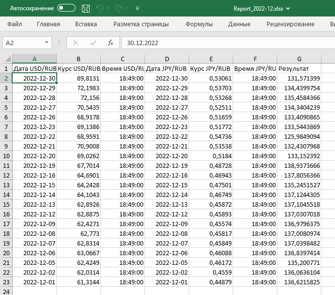

# Тестовое задание

## Задача
Скопировать с сайта Московской биржы данные по индикативным курсам за прошлый месяц в файл Excel (.xlsx) и отправить его по почте.

## О решении
Программа получает данные для отправки письма из файла `mailing_params.json`

Файл с параметрами ***необходимо создать***, пример - `example_mailing_params.json`

В нем указать:
- почту получателя (`recipient`)
- почту отправителя (`sender`)
- smtp сервер (`server`)
- порт (`port`)
- пароль приложения (`password`)

При выполнении задания были использованы:
- ОС Windows 10
- Редактор vscode
- Python 3.11.0
- Библиотеки bs4, lxml, openpyxl, requests

### Пример полученного на почту сообщения

### Пример содержания файла отчета
